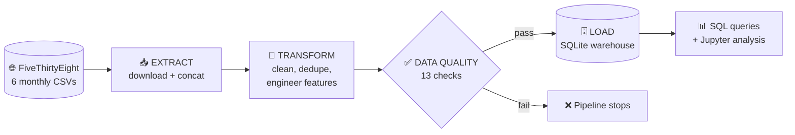
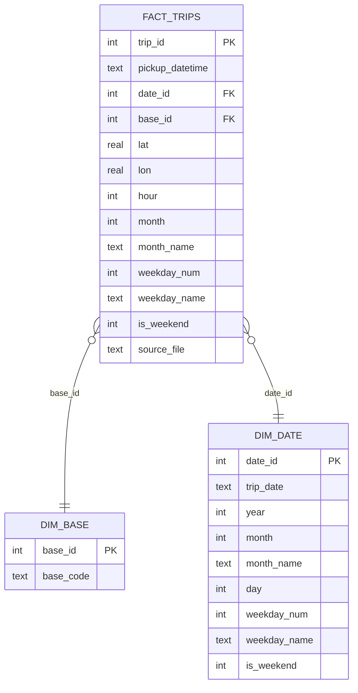
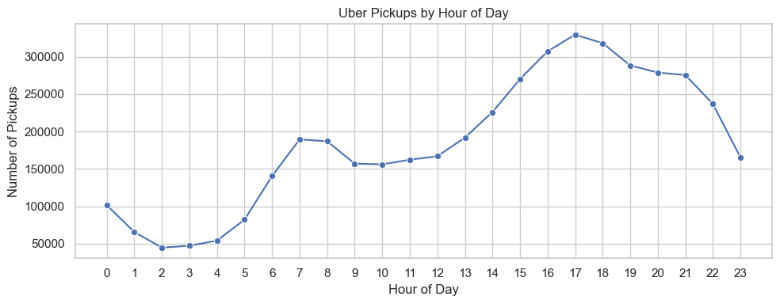
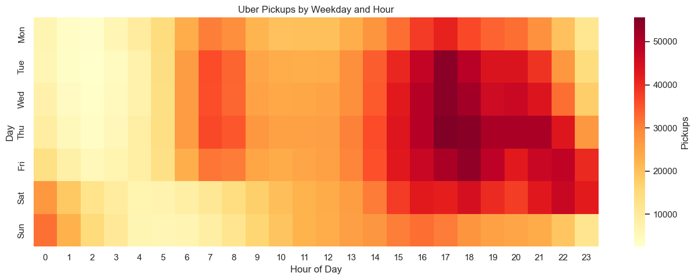
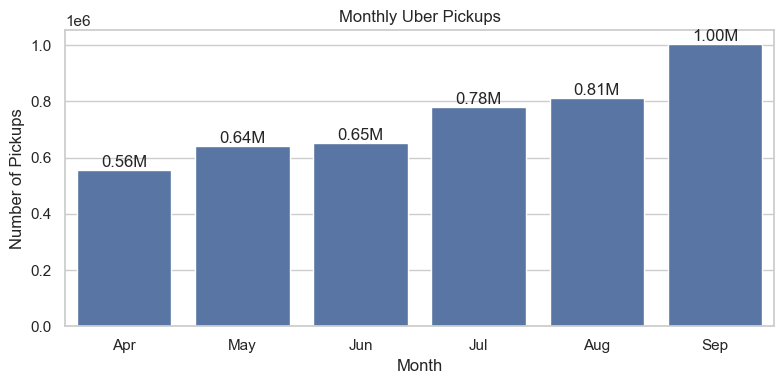
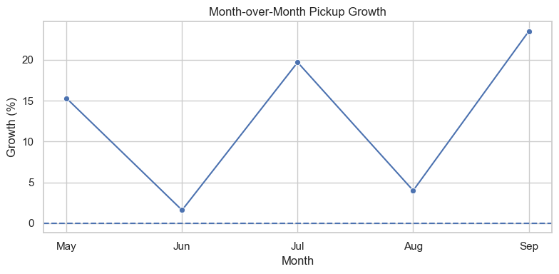
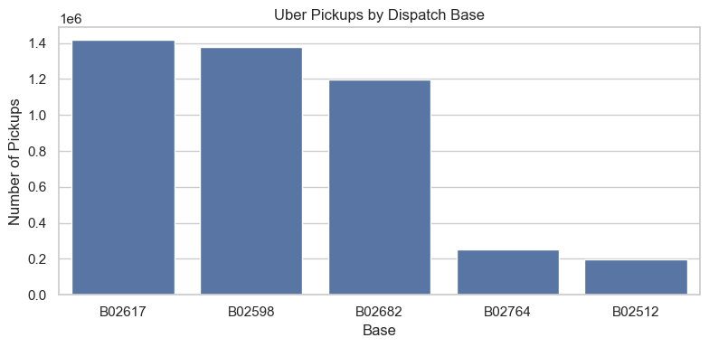
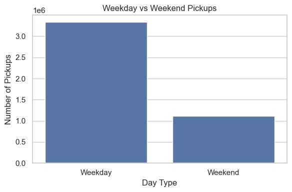
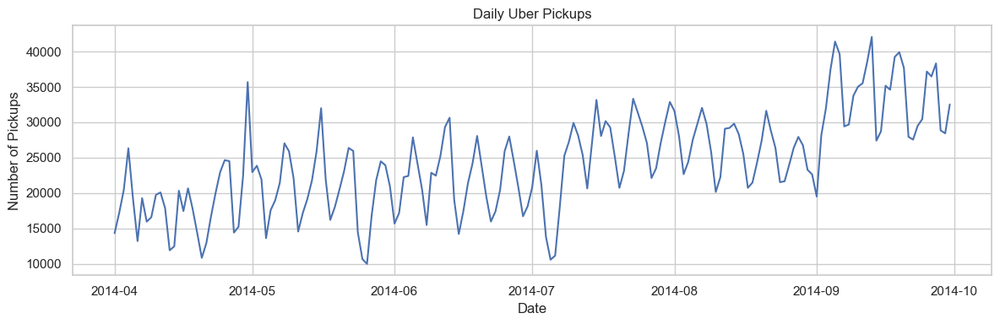

<div align="center">

# 🚕 Uber NYC Pickups: ETL Pipeline & Analysis

**An end-to-end data engineering project: raw CSVs → cleaned star-schema warehouse → insights**


</div>

---

## 📌 Overview

This project builds a complete **Extract → Transform → Load (ETL)** pipeline for the Uber NYC pickup dataset (April to September 2014, from FiveThirtyEight's Uber TLC FOIL response). It downloads roughly 4.5 million raw trip records, cleans and validates them (4,443,196 trips remain), reshapes them into a **star schema**, and loads them into a **SQLite data warehouse** that can be queried with plain SQL.

On top of the warehouse, a Jupyter notebook explores demand patterns: when, where, and through which bases people take Uber rides in New York City.

### ✨ Highlights

- **One-command pipeline**: `python etl.py` downloads, cleans, validates, and loads everything.
- **Star schema** with one fact table and two dimension tables, indexed for fast analytics.
- **13 automated data quality checks** act as a gate: nothing is loaded if a check fails.
- **Idempotent loads**: re-running the pipeline rebuilds the warehouse without duplicating data.
- **Detailed logging** of every stage, including how many rows each cleaning step removed.
- **SQL + Python analysis** with charts and an interactive hotspot map.

---

## 🏗️ Architecture



| Stage | What happens |
|---|---|
| **Extract** | Downloads the six monthly CSVs (Apr to Sep 2014), skipping files already on disk, and combines them into one DataFrame. |
| **Transform** | Parses timestamps, drops rows with invalid dates or coordinates, filters GPS points outside the NYC bounding box, removes exact duplicates, and derives date/time features. |
| **Quality gate** | Runs 13 checks (nulls, coordinate bounds, valid hours, unique keys, foreign-key integrity). Any failure stops the pipeline before loading. |
| **Load** | Creates the schema, clears the tables, bulk-loads in chunks, and verifies the final row counts. |

---

## 🗂️ Data Model (Star Schema)



Indexes on `fact_trips(date_id)`, `fact_trips(base_id)`, and `fact_trips(hour)` keep aggregations fast.

---

## 📁 Project Structure

```
uber-etl/
├── etl.py              # The complete ETL pipeline
├── queries.sql         # Analysis queries (run in DBeaver or any SQLite client)
├── analysis.ipynb      # Charts and findings
├── requirements.txt
├── charts/             # Chart images used in this README
├── docs/               # ER diagram and screenshots
├── data/               # (git-ignored) raw CSVs and the SQLite warehouse
└── logs/               # (git-ignored) pipeline run logs
```

---

## 🚀 Getting Started

### 1. Clone and install

```bash
git clone https://github.com/<your-username>/uber-etl.git
cd uber-etl
pip install -r requirements.txt
```

### 2. Run the pipeline

```bash
python etl.py                 # full pipeline
python etl.py --verbose       # debug-level logging
python etl.py --skip-checks   # skip data quality checks (not recommended)
```

A successful run ends with a line like `Pipeline SUCCEEDED`, and creates `data/uber_warehouse.db`.

### 3. Explore the data

- **SQL:** open `data/uber_warehouse.db` in [DBeaver](https://dbeaver.io/) or any SQLite client and run the queries in `queries.sql`.
- **Notebook:** run `jupyter notebook` and open `analysis.ipynb` to reproduce the tables, charts, and the interactive hotspot map.

---

## 🔎 Sample Queries

```sql
-- Trips by hour of day
SELECT hour, COUNT(*) AS trips
FROM fact_trips
GROUP BY hour
ORDER BY hour;

-- Share of trips per dispatch base
SELECT b.base_code,
       COUNT(*) AS trips,
       ROUND(100.0 * COUNT(*) / SUM(COUNT(*)) OVER (), 2) AS pct
FROM fact_trips f
JOIN dim_base b ON b.base_id = f.base_id
GROUP BY b.base_code
ORDER BY trips DESC;

-- Pickup hotspots on a ~1 km grid
SELECT ROUND(lat, 2) AS lat_bin, ROUND(lon, 2) AS lon_bin, COUNT(*) AS trips
FROM fact_trips
GROUP BY lat_bin, lon_bin
ORDER BY trips DESC
LIMIT 20;
```

More in [`queries.sql`](queries.sql): monthly growth with window functions, weekday × hour heatmap data, daily trend via `dim_date`, and more.

---

## 📈 Key Findings

Analysis of **4,443,196 cleaned pickups** across 183 days (1 April to 30 September 2014) and 5 dispatch bases.

| # | Finding | Result |
|:-:|---|---|
| 1 | **Peak hour** | **5 PM (17:00)** with 329,489 pickups, followed by 6 PM and 4 PM |
| 2 | **Quietest hour** | **2 AM** with 44,781 pickups, about 7x lower than the peak |
| 3 | **Weekday vs weekend** | Weekdays average **25,427** pickups/day vs **21,390** on weekends (about 19% higher) |
| 4 | **Base concentration** | **B02617** handles 31.86% of trips; the top 3 bases (B02617, B02598, B02682) account for about 90% |
| 5 | **Growth** | Monthly pickups rose **80.2%** from April (556,143) to September (1,002,190), the first month above 1M |
| 6 | **Busiest area** | The ~1 km cell around **(40.76, -73.98)** in Midtown Manhattan holds **221,153 pickups (about 5% of all trips)** |

**What the patterns say**

- 🕔 **Weekdays follow a commuter rhythm.** There's a morning bump around 7 to 8 AM and a much larger evening peak at 5 to 6 PM. Thursday at 5 PM is the single busiest weekday-hour (55,576 pickups).
- 🌙 **Weekends shift toward the night.** Friday and Saturday evenings stay busy until midnight, and the early hours of Saturday and Sunday are the only time weekends beat weekdays (Sunday 12 AM has 32,084 pickups versus 6,309 on Monday).
- 📈 **Growth was uneven.** Month-over-month gains were +15.3% (May), +1.6% (Jun), +19.7% (Jul), +4.0% (Aug), and +23.5% (Sep).
- 🗺️ **Demand is concentrated.** The top 20 grid cells, all in Manhattan, hold a large share of all pickups, led by Midtown, Chelsea/Flatiron, and the Financial District.

### Visuals

<div align="center">

**Pickups by hour of day**



**Weekday × hour heatmap**



</div>

| Monthly pickups | Month-over-month growth |
|:---:|:---:|
|  |  |

| Pickups by base | Weekday vs weekend |
|:---:|:---:|
|  |  |

**Daily pickups**



🗺️ An interactive pickup hotspot map is produced in the last map cell of `analysis.ipynb`.

---

## ✅ Data Quality Checks

The pipeline refuses to load data unless all of these pass:

- Fact table is not empty
- No nulls in `pickup_datetime`, `lat`/`lon`, `base_id`, or `date_id`
- Latitude and longitude fall inside the NYC bounding box
- `hour` is between 0 and 23
- Every `base_id` and `date_id` in the fact table exists in its dimension
- Primary keys (`trip_id`, `base_id`, `date_id`) are unique

**Cleaning rules:** unparseable timestamps, non-numeric or out-of-range coordinates, and exact duplicate rows (same time, location, and base) are dropped, and each step logs how many rows it removed.

---

## 🛠️ Tech Stack

| Purpose | Tool |
|---|---|
| Language | Python |
| Data wrangling | pandas, NumPy |
| Database access | SQLAlchemy |
| Warehouse | SQLite |
| SQL client | DBeaver |
| Visualization | Matplotlib, Seaborn, Plotly |

---

## 🔭 Future Improvements

- [ ] Fail the pipeline when any monthly download is missing, and download to a temp file first
- [ ] Make the load atomic (delete and insert in a single transaction)
- [ ] Add a `pytest` suite for the cleaning and quality-check functions
- [ ] Process data month by month to reduce memory use
- [ ] Support incremental loads instead of full reloads
- [ ] Migrate the warehouse to PostgreSQL
- [ ] Add a Streamlit dashboard and schedule runs with Airflow or cron

---

## 📚 Data Source

[FiveThirtyEight: Uber TLC FOIL Response](https://github.com/fivethirtyeight/uber-tlc-foil-response), Uber pickup data in New York City obtained via a Freedom of Information Law request to the NYC Taxi & Limousine Commission.

---

<div align="center">

If you found this useful, consider giving the repo a ⭐

</div>
